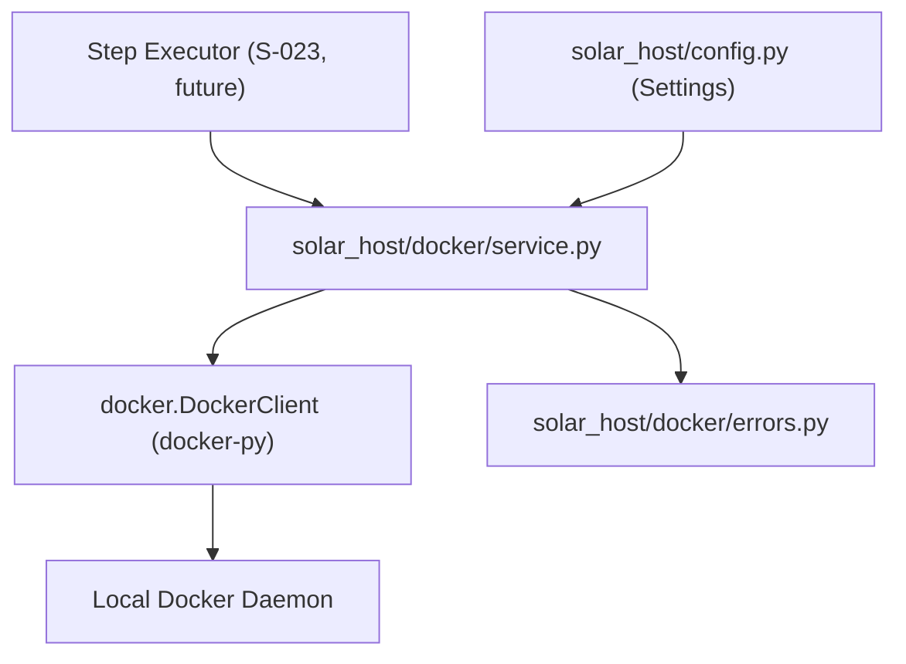

# S-022: Docker Execution Layer for Solar Host

## Context

Solar Host needs a Docker execution layer before it can run SuperNova job steps. This layer wraps `docker-py` with lifecycle primitives the step executor (S-023) can compose without knowing low-level Docker API details.

- **Repo**: [host/](host/) at `/home/csakyzsolt/Projects/DAMIT/solar/repositories/host`
- **Branch**: `feature/S-022`
- **Key existing file**: [solar_host/config.py](host/solar_host/config.py) (settings via `pydantic-settings`)
- **Conventions**: Black (88 cols), Ruff, Python 3.12+, FastAPI, async with `asyncio.to_thread` for blocking I/O

## Architecture




The Docker layer is a **single package** `solar_host/docker/` with:


| File          | Responsibility                                   |
| ------------- | ------------------------------------------------ |
| `__init__.py` | Re-exports public API                            |
| `service.py`  | `DockerService` class with all lifecycle methods |
| `errors.py`   | Structured exception hierarchy                   |


## Step 1: Add dependency and config settings

**Dependency**: Add `docker>=7.0.0` to `[project.dependencies]` in [pyproject.toml](host/pyproject.toml).

**Config additions** in [solar_host/config.py](host/solar_host/config.py) — new fields on `Settings`:

```python
jobs_dir: str = "./jobs"
container_uid: int = 1000
container_gid: int = 1000
hf_cache_dir: str = "./hf-cache"
```

`**.env.example` update**: Add the new env vars with defaults.

## Step 2: Create structured error hierarchy

New file `solar_host/docker/errors.py`:

- `DockerServiceError(Exception)` — base for all Docker layer errors
- `DaemonUnavailableError(DockerServiceError)` — daemon not reachable
- `ImagePullError(DockerServiceError)` — image pull failed (stores image ref, reason)
- `ContainerStartError(DockerServiceError)` — container failed to start
- `ContainerNonZeroExitError(DockerServiceError)` — container exited with non-zero code (stores exit code, last stderr lines)

Each error carries structured fields (not just a message string) so callers can inspect programmatically.

## Step 3: Implement `DockerService`

New file `solar_host/docker/service.py`:

The class is **synchronous internally** (docker-py is sync). The step executor (S-023) will call these via `asyncio.to_thread`. This keeps the Docker layer simple and testable without async fixtures.

### Public API

```python
class DockerService:
    def __init__(self, settings: Settings | None = None): ...

    def pull_image(self, image: str, tag: str = "latest") -> None: ...
    def create_container(self, image: str, job_id: str, step_name: str, environment: dict[str, str], gpu: bool = False) -> str: ...
    def start_container(self, container_id: str) -> None: ...
    def stop_container(self, container_id: str, timeout: int = 30) -> None: ...
    def remove_container(self, container_id: str, force: bool = False) -> None: ...
    def inspect_container(self, container_id: str) -> ContainerStatus: ...
    def stream_logs(self, container_id: str, follow: bool = True) -> Iterator[str]: ...
    def wait_container(self, container_id: str) -> int: ...
```

### Key design decisions

1. `**create_container**` builds the bind-mount config from `settings.jobs_dir`, `job_id`, and the workspace contract:
  - `JOBS_DIR/<job-id>/models` -> `/workspace/models`
  - `JOBS_DIR/<job-id>/data` -> `/workspace/data` (read-only)
  - `JOBS_DIR/<job-id>/output` -> `/workspace/output`
  - `JOBS_DIR/<job-id>/config` -> `/workspace/config`
  - `settings.hf_cache_dir` -> `/workspace/.cache/huggingface`
2. **Container user**: Set to `container_uid:container_gid` from settings.
3. **GPU access**: When `gpu=True`, add `device_requests` with "all" GPUs. The exact device selection is deferred to S-024.
4. **No privileged mode, no host network.**
5. **Container naming**: `solar-job-{job_id}-{step_name}` for easy identification.
6. `**stream_logs`** returns an `Iterator[str]` yielding decoded lines — the caller (S-025 log streaming) can decide whether to buffer or forward in real time.
7. `**wait_container`** wraps `container.wait()` and raises `ContainerNonZeroExitError` if exit code != 0.

### Data class

```python
@dataclass
class ContainerStatus:
    container_id: str
    status: str  # "created", "running", "exited", etc.
    exit_code: int | None
    started_at: str | None
    finished_at: str | None
```

## Step 4: Write tests

New file `tests/test_docker_service.py`:

- Mock `docker.DockerClient` (patch `docker.from_env`)
- Test lifecycle methods: pull success/failure, create with correct mounts/env/user, start/stop/remove, inspect status mapping, log streaming
- Test error wrapping: daemon unavailable -> `DaemonUnavailableError`, image not found -> `ImagePullError`, non-zero exit -> `ContainerNonZeroExitError`
- No real Docker daemon required in unit tests

## Step 5: Update documentation and `.env.example`

- Update `.env.example` with new config vars
- Verify README if the new module needs mention (likely not yet — it has no routes)
- Ensure all new files pass `black` and `ruff check`

---

## Progress log

### 2026-05-14 — S-022 complete

All five steps implemented and verified:

- **deps-config**: Added `docker>=7.0.0` to `pyproject.toml`; added `jobs_dir`, `container_uid`, `container_gid`, `hf_cache_dir` fields to `Settings` in `solar_host/config.py`. Initialized `uv` lock file (`.venv` + `uv.lock`).
- **errors**: Created `solar_host/docker/errors.py` with `DockerServiceError`, `DaemonUnavailableError`, `ImagePullError`, `ContainerStartError`, `ContainerNonZeroExitError` — each with structured fields.
- **service**: Implemented `solar_host/docker/service.py` (`DockerService`, `ContainerStatus`) and `solar_host/docker/__init__.py` re-exporting the public API.
- **tests**: 26 unit tests in `tests/test_docker_service.py`, all passing (`uv run pytest`). No real Docker daemon required — all tests use `MagicMock`.
- **docs-lint**: Updated `.env.example`; ran `black` (2 files reformatted) and `ruff check` via `nix-shell -p ruff` (all checks passed).

